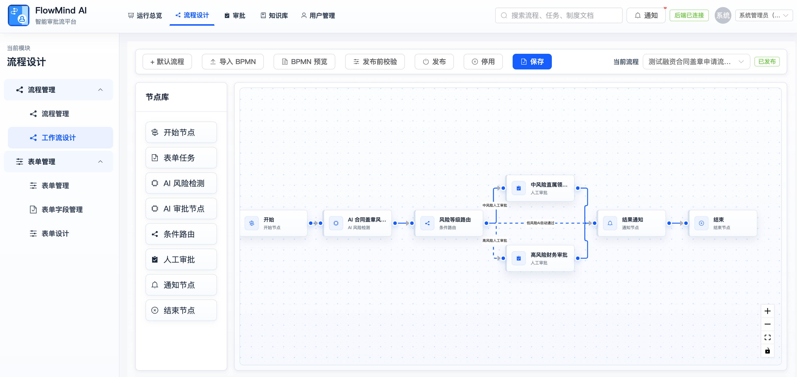
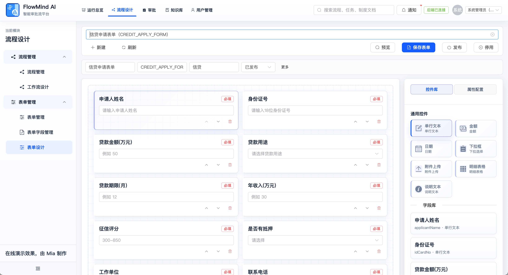
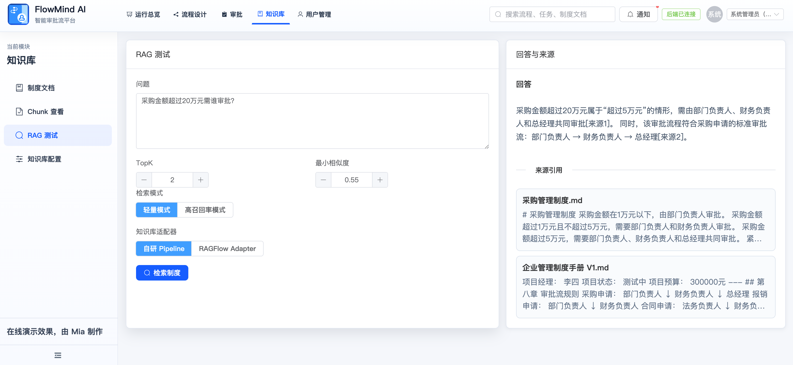

# FlowMind AI

> 智能审批流平台：把流程、表单、权限、企业制度知识库和 AI 风险判断串成一套可配置、可追溯的审批系统。

FlowMind AI 面向企业内部审批场景，支持可视化工作流设计、动态表单搭建、审批任务流转、RAG 制度检索、AI 风险评分与自动路由。当前 MVP 已跑通“信贷审批”场景，可演示低风险自动通过、中高风险转人工复核、来源引用与审计留痕。

## 核心能力

| 模块 | 能力 |
| --- | --- |
| 流程设计 | 可视化编排开始、表单任务、AI 风险检测、条件路由、人工审批、通知、结束节点 |
| 表单设计 | 动态字段、控件配置、必填校验、发布版本、运行态表单渲染 |
| 审批运行 | 发起审批、待办处理、已办查看、实例追踪、任务日志 |
| 知识库 | 制度文档上传、Chunk 查看、RAG 检索、回答来源引用 |
| AI 风险 | 基于表单数据和制度片段输出风险等级，并驱动流程自动分流 |
| 用户权限 | 用户、角色、菜单授权，支撑后台模块访问控制 |

## 技术栈

- 后端：Java 21、Spring Boot 3、Spring Data JPA、PostgreSQL、Qdrant、Maven
- 前端：Vue 3、Vite、Element Plus、Vue Router、Vue Flow
- AI/RAG：自研 RAG Pipeline，预留 RAGFlow Adapter
- 部署：Docker Compose、Nginx、Shell 脚本

## 最小 MVP 演示地址

- 前端页面：`http://150.158.119.197`
- 后端健康检查：`http://150.158.119.197/api/health`
- 跑通文档：[docs/最小MVP跑通流程文档.md](docs/最小MVP跑通流程文档.md)

### 演示截图

**工作流设计**



**信贷申请表单设计**



**RAG 测试与来源引用**



## 快速启动

### 1. 启动基础设施

```bash
docker compose up -d
```

### 2. 启动后端

```bash
cd flowmind-server
./mvnw spring-boot:run
```

### 3. 启动前端

```bash
cd flowmind-web
npm install
npm run dev
```

启动后打开 `http://localhost:5173`。

## 目录结构

```text
FlowMindAI
├── flowmind-server/      # Spring Boot 后端
├── flowmind-web/         # Vue 前端
├── docs/                 # 制度样例、MVP 跑通文档、录屏脚本
├── image/                # README 图片与视觉素材
├── data/                 # 本地开发数据
├── 需求文档/             # 产品、技术、接口和原型文档
└── docker-compose.yml    # 本地基础设施
```

## 关键文档

- [docs/最小MVP跑通流程文档.md](docs/最小MVP跑通流程文档.md)
- [docs/录屏脚本文档.md](docs/录屏脚本文档.md)
- [需求文档/FlowMind AI 核心模型与产品规划文档.md](需求文档/FlowMind%20AI%20核心模型与产品规划文档.md)
- [需求文档/FlowMind AI 前后端接口文档.md](需求文档/FlowMind%20AI%20前后端接口文档.md)

## 当前状态

- 已完成：流程/表单/审批/知识库/RAG/AI 风险判断的 MVP 主链路。
- 可演示：信贷审批流程、表单设计、工作流设计、RAG 问答与来源引用。
- 下一步：补齐测试、部署说明、权限细节和更多审批场景模板。
