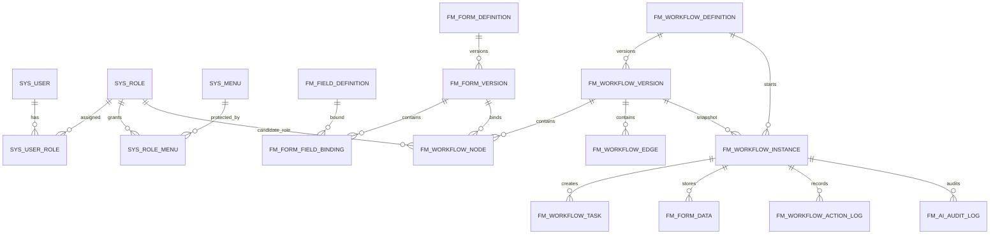
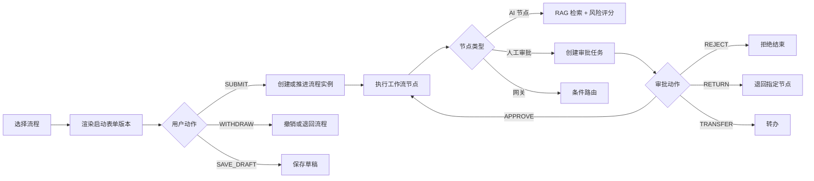

# FlowMind AI

FlowMind AI 是一个面向企业内部管理场景的AI自动审批流平台。系统目标是让管理人员可以动态定义审批流程、表单字段、审批表单、BPMN 工作流、角色权限与菜单权限，并在流程运行时结合企业制度知识库、RAG 检索和大模型能力完成风险评分、依据解释、AI审批、自动路由与审计追踪。

当前仓库处于开发阶段，后端自研RAG功能已完成。后续前后端实现应以 `需求文档/FlowMind AI 核心模型与产品规划文档.md` 和 `需求文档/FlowMind AI 原型设计说明.md` 为准。

## 项目定位

企业审批系统通常会遇到几个问题：

- 流程变化快，审批节点、审批人、表单字段经常需要调整。
- 审批依据分散在制度文档、管理办法、历史记录和人工经验里。
- 高风险申请难以及时识别，低风险申请又容易被过度人工处理。
- 表单和流程一旦改版，历史审批记录容易出现展示错乱。
- 权限、菜单、角色、任务归属如果没有统一模型，后期会很难扩展。

FlowMind AI 的核心思路是：

- 用字段定义、表单版本、工作流版本支撑可配置审批。
- 用 RAG 检索企业制度，为 AI 风险评分提供来源引用和依据说明。
- 用风险等级和条件路由把申请自动流转到不同审批角色、包括AI进行自动审批、AI审批节点风险值设置。
- 用实例快照、任务日志、表单数据版本和 AI 审计日志保证可解释、可追溯、可审计。

## 核心能力

### 1. 动态字段与表单

- 支持选择数据库已有字段。
- 支持创建平台自定义字段。
- 支持系统内置字段，例如发起人、部门、流程状态、风险分。
- 表单控件绑定字段定义。
- 支持必填、格式、范围、长度、枚举、显示隐藏、只读可编辑等校验和权限配置。
- 表单发布后形成不可变版本，历史流程实例始终渲染当时的表单版本。

### 2. 工作流设计

- 支持流程管理、版本管理、发布和停用。
- 支持 BPMN 风格工作流设计。
- 支持开始节点、结束节点、表单任务、人工审批、AI 风险检测、AI 审批、排他网关、并行网关、通知节点和脚本任务。
- 节点必须能绑定角色、审批人策略和表单版本。
- 节点之间通过连线和条件表达式决定流转路径。
- 支持基于风险评分的自动路由。

### 3. 审批运行

- 发起人选择流程后，系统渲染流程启动表单。
- 点击提交表单触发统一流程动作接口，创建或推进流程实例。
- 点击撤销表单同样触发统一流程动作接口，由后端根据动作类型决定撤销、退回或终止。
- 审批人在待办列表中打开任务，系统按任务绑定的表单版本渲染审批页面。
- 已审批列表和实例追踪必须可查看历史表单、审批意见、AI 依据、RAG 来源和流程日志。

### 4. AI 风险评分与 RAG 依据

- 内置自研 RAG Pipeline，用于企业制度检索、来源引用和风险依据支撑。
- AI 节点根据流程上下文、表单数据、制度片段和策略配置输出风险评分。
- 风险等级可分为 LOW、MEDIUM、HIGH、CRITICAL。
- 风险结果可以驱动工作流路由，例如高风险进入财务或法务复核，低风险进入快速审批。
- 系统预留 RAGFlow Adapter，后续可对接外部 RAGFlow 知识库平台。

### 5. 权限与菜单

- 用户可以绑定多个角色。
- 菜单采用层级结构管理。
- 角色通过菜单授权获得页面访问能力。
- 工作流节点通过角色、用户、直属领导、部门负责人等策略计算候选审批人。
- 审批任务归属必须可解释，能说明任务为什么分配给某个用户或角色。

## 产品信息架构

顶部一级导航：

```text
运行总览
流程设计
审批
知识库
用户管理
```

流程设计二级导航：

```text
流程管理
流程表单字段管理
流程表单管理
工作流设计管理
```

审批二级导航：

```text
待审批
已审批
发起审批
```

知识库二级导航：

```text
制度文档
Chunk 查看
RAG 测试
知识库配置
```

用户管理二级导航：

```text
个人信息
角色管理
用户管理
菜单管理
```

## 核心领域模型



关键对象：

- `Field Definition`：字段定义，描述业务数据本身。
- `Form Definition`：表单定义，描述一个可复用表单。
- `Form Version`：表单版本，发布后的表单快照。
- `Workflow Definition`：流程定义，描述业务流程主对象。
- `Workflow Version`：工作流版本，保存 BPMN、节点、连线和条件。
- `Workflow Node`：工作流节点，绑定表单、角色、审批策略或 AI 策略。
- `Workflow Edge`：节点连线，保存源节点、目标节点和条件表达式。
- `Workflow Instance`：流程实例，记录一次真实审批运行。
- `Workflow Task`：审批任务，记录某个用户或角色需要处理的节点任务。
- `Form Data`：表单数据，保存实例在不同节点提交的数据快照。
- `AI Audit Log`：AI 审计日志，保存 RAG 来源、风险依据、模型输出和评分。

## 流程动作模型

系统建议统一使用流程动作接口承载提交、撤销、同意、拒绝、退回、转办等行为。



待办、已办和查看页面需要携带以下关键 ID，保证页面可以正确跳转和渲染：

- `taskId`
- `instanceId`
- `workflowDefinitionId`
- `workflowVersionId`
- `formDefinitionId`
- `formVersionId`
- `formDataId`
- `businessKey`
- `nodeKey`

## 数据库设计概览

详细字段设计见：

- `需求文档/FlowMind AI 核心模型与产品规划文档.md`

核心表建议分组如下：

### 用户与权限

- `sys_user`
- `sys_role`
- `sys_user_role`
- `sys_menu`
- `sys_role_menu`

### 字段与表单

- `fm_field_definition`
- `fm_form_definition`
- `fm_form_version`
- `fm_form_field_binding`

### 流程与工作流

- `fm_workflow_definition`
- `fm_workflow_version`
- `fm_workflow_node`
- `fm_workflow_edge`
- `fm_ai_strategy`

### 流程运行

- `fm_workflow_instance`
- `fm_workflow_task`
- `fm_form_data`
- `fm_form_data_index`
- `fm_workflow_action_log`

### AI 与知识库

- `fm_ai_audit_log`
- `fm_notification`
- `fm_knowledge_document`
- `fm_knowledge_chunk`

## 前端原型

HTML 静态原型位置：

```text
需求文档/原型/FlowMind AI HTML页面原型.html
```

原型覆盖页面：

- 运行总览
- 流程管理
- 流程表单字段管理
- 流程表单管理
- 表单设计器
- 工作流设计管理
- 待审批
- 已审批
- 发起审批
- 审批表单运行态
- 制度文档
- Chunk 查看
- RAG 测试
- 知识库配置
- 个人信息
- 角色管理
- 用户管理
- 菜单管理

视觉方向：

- 整体采用 Material Design 家族风格。
- 管理页面强调白色纸片、浅灰背景、层级阴影、清晰主色按钮和适中信息密度。
- 表单设计器和工作流设计器同样采用 Material 风格，使用三栏结构、网格画布、可操作卡片、柔和阴影和明确的工具条。

## 建议技术栈

### 后端

- Java 21
- Spring Boot 3.x
- Spring Security
- MyBatis Plus 或 JPA
- PostgreSQL
- Qdrant 或兼容向量数据库
- DashScope/Qwen 或兼容 OpenAI 协议的大模型服务
- Maven

### 前端

- Vue 3
- TypeScript
- Vite
- Element Plus
- Pinia
- Vue Router
- BPMN/流程图组件库
- 表单设计器组件化封装

### 基础设施

- Docker Compose
- PostgreSQL
- Qdrant
- 本地企业制度文档目录

## 仓库目录

```text
FlowMindAI
├── docs/                         # 企业制度示例文档
├── flowmind-server/              # 后端工程目录
├── flowmind-web/                 # 前端工程目录
├── data/                         # 本地开发数据目录
├── 需求文档/                     # 产品需求、技术设计、接口和原型文档
│   ├── FlowMind AI 核心模型与产品规划文档.md
│   ├── FlowMind AI 原型设计说明.md
│   ├── FlowMind AI 前后端接口文档.md
│   └── 原型/
│       └── FlowMind AI HTML页面原型.html
└── docker-compose.yml
```

## 开发原则

### 后端原则

- 参考阿里巴巴 Java 代码规范。
- 领域对象、服务、策略和适配器边界清晰。
- 对字段、表单、流程、节点、实例等核心对象使用版本化设计。
- 对 AI、RAGFlow、通知等外部能力保留 Adapter 层，便于后续替换。
- 对审批动作使用统一模型，避免每个按钮单独设计一套接口。
- 重要行为必须记录审计日志。

### 前端原则

- 页面必须先满足业务可用性，再考虑视觉表现。
- 管理页面采用稳定、清晰、可扫描的 Material 风格。
- 组件尽量复用，例如列表页、查询区、表单项、属性面板、分页、弹窗、二次确认、运行态表单。
- 表单设计器和工作流设计器要强化拖拽、绑定、校验、发布前检查和版本快照。
- 待审批、已审批、查看页面必须通过后端返回的关键 ID 渲染正确的历史表单版本。

## 里程碑规划

### 第一阶段：产品模型与原型确认

- 明确顶部导航和二级导航。
- 明确字段、表单、工作流、实例、任务、权限、AI 审计等核心对象。
- 输出数据库表设计。
- 输出 HTML 页面原型。
- 确认列表页、设计器、审批页和权限页的交互。

### 第二阶段：后端领域模型重构

- 建立核心表结构。
- 实现用户、角色、菜单权限。
- 实现字段、表单、表单版本。
- 实现流程定义、工作流版本、节点和连线。
- 实现统一流程动作接口。
- 实现审批任务、实例追踪和审计日志。

### 第三阶段：前端页面开发

- 搭建统一布局、顶部导航和动态左侧菜单。
- 实现管理页通用列表模板。
- 实现字段管理、表单管理和流程管理。
- 实现表单设计器。
- 实现工作流设计器。
- 实现待审批、已审批、发起审批和运行态表单。
- 实现用户、角色和菜单权限管理。

### 第四阶段：AI 与 RAG 增强

- 接入自研 RAG Pipeline。
- 实现制度检索、来源引用和风险依据展示。
- 实现 AI 风险检测节点。
- 实现风险评分驱动的条件路由。
- 补充 RAGFlow Adapter。

### 第五阶段：审计、测试与发布

- 完善审批动作日志。
- 完善 AI 审计日志。
- 完善表单版本和流程版本回放。
- 补充单元测试、集成测试和端到端测试。
- 完成本地运行文档和部署文档。

## 文档索引

- 产品需求：`需求文档/FlowMind AI 产品需求文档.md`
- V1 梳理：`需求文档/FlowMind AI V1产品需求梳理.md`
- 技术设计：`需求文档/技术设计文档.md`
- 核心模型与表设计：`需求文档/FlowMind AI 核心模型与产品规划文档.md`
- 原型设计说明：`需求文档/FlowMind AI 原型设计说明.md`
- HTML 页面原型：`需求文档/原型/FlowMind AI HTML页面原型.html`
- 前后端接口文档：`需求文档/FlowMind AI 前后端接口文档.md`

## 当前状态说明

当前重点：工作流模型建立，UI设计调整，前端开发，后端工作流模块开发（RAG部分已开发完毕）。

